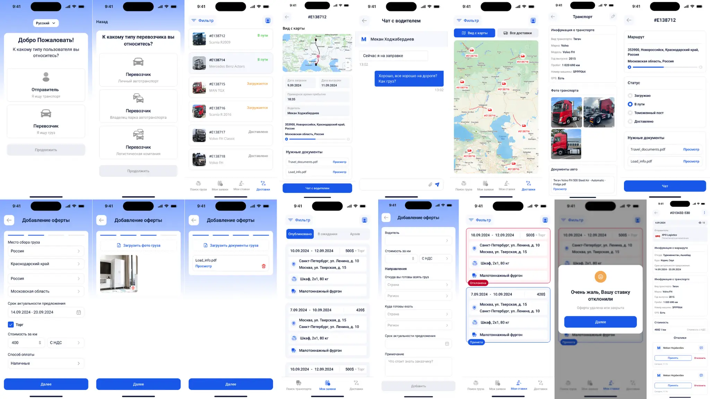
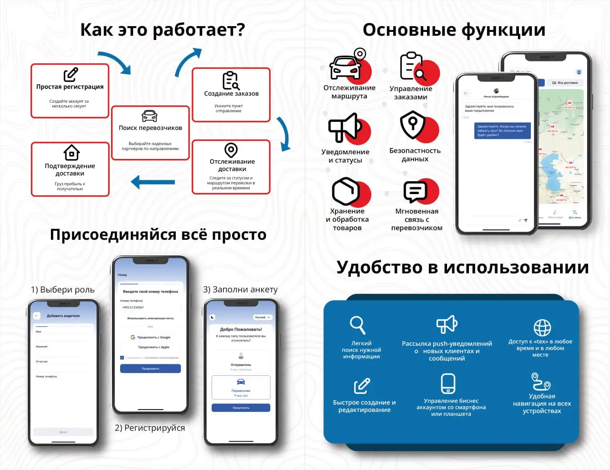
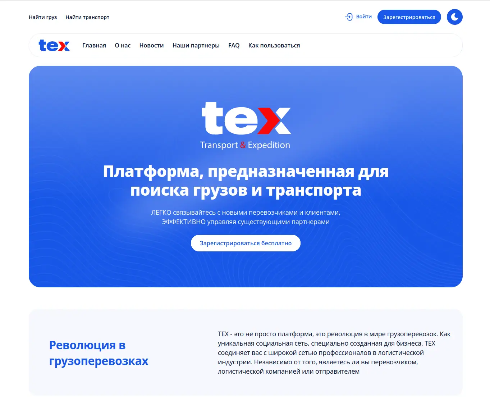

# texApi

A platform designed to coordinate freight transportation.
Logistics related api ecosystem, written in Golang GIN, Postgres.

# 📦 Project Overview

* User authentication & JWT-based sessions
* Messaging, conversation, call-room handling
* Offers, logistics, GPS tracking
* Notifications (SMTP, Firebase)
* Content & media management
* Analytics and background schedulers
* Price quote generation and matching
* Newsletter management
* Wiki & news content
* Organization, driver, company management
* File handling, image/video processing
* SQL safety utilities
* WebSocket real-time services

### **Key Libraries / Features Detected**

* JWT authentication
* SQL safety and query helpers
* SMTP email sending
* Firebase push notifications
* WebSocket real-time communication
* File and media handling utilities
* Analytics generation scheduler

---

# 🧩 Major Modules Overview

### **Authentication**
Handles login, logout, OTP, OAuth, session management, token issuance, user activity tracking.

### **Messaging + Chat**
Real-time features implemented via WebSockets and repositories for messages, conversations, reactions, call rooms.

### **Offers & Logistics**
Cargo, offer, offer-response, pricing, packaging types, GPS logs, analytics, company/driver operations.

### **Content & Media**
Upload, validate, process (including WebP compression), serve partial content (video), content management system.

---

### Milestones:
+ [ ] passwords to bcrypt
+ [ ] HEADER AppLanguage: (options: ru en tk)

---

# 📚 Documentation

The project includes extensive docs under `/docs/`, such as:

* `analytics.md` — Analytics workflow
* `call_room_docs.md` — Call room system
* `firebaseNotification.md`
* `auth_workflow.md`
* `Price Quote Docs tbl_price_quote.md`
* `app_docs.md`

